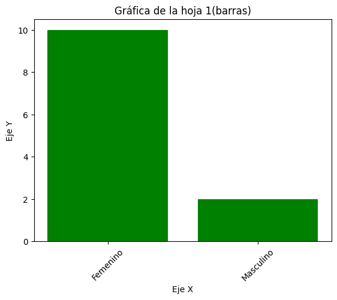
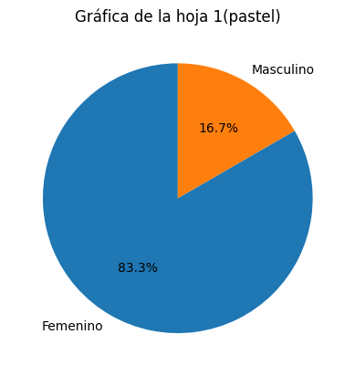
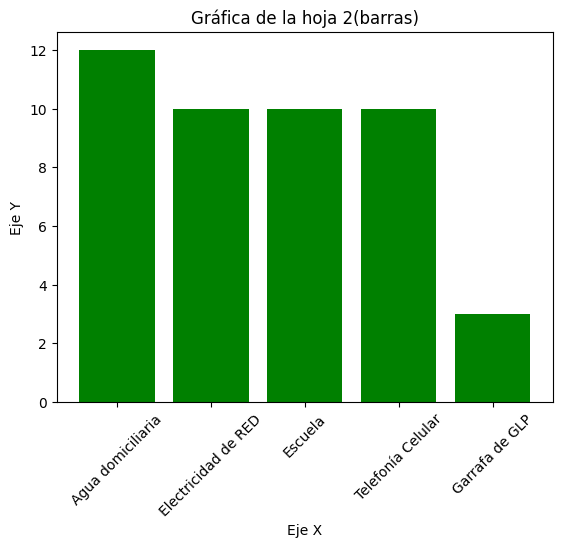
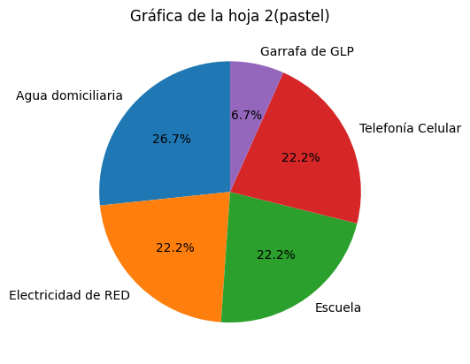
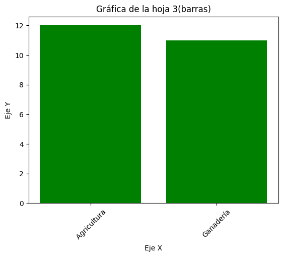
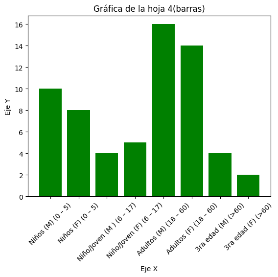
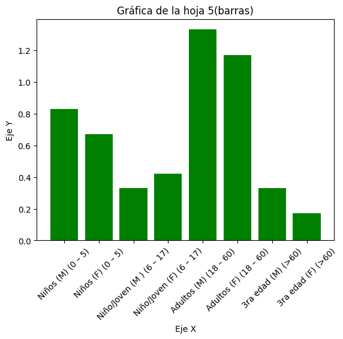
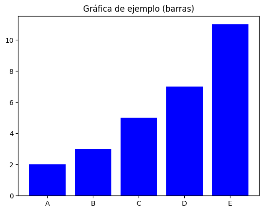
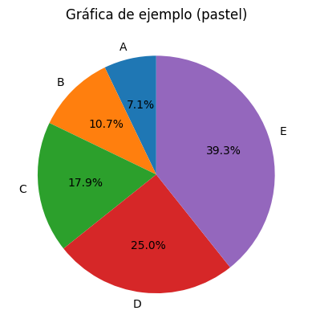

# otm106_practica4

## Estudiante: Walter Antonio Machaca Anze

## Materia: Ofimática y tecnología multimedia OTM-106

## Captura de Gráficas

Gráfico1 Barras

Gráfico1 pastel 

Gráfico2 Barras

Gráfico2 pastel 

Gráfico3 Barras

Gráfico3 pastel 

Gráfico4 Barras

Gráfico4 pastel 

Gráfico5 Barras

Gráfico5 pastel 

Gráfico ejemplo Barras

Gráfico4 ejemplo pastel 

