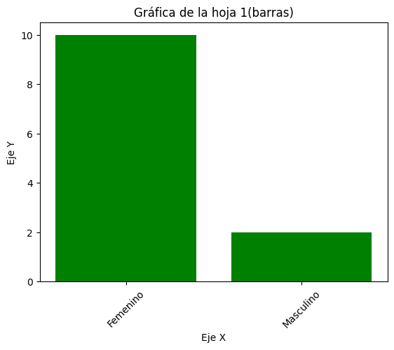
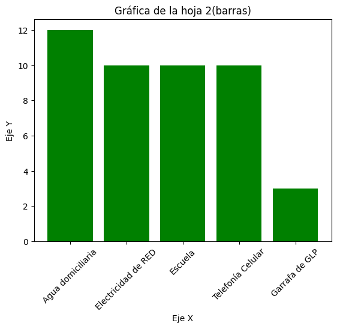
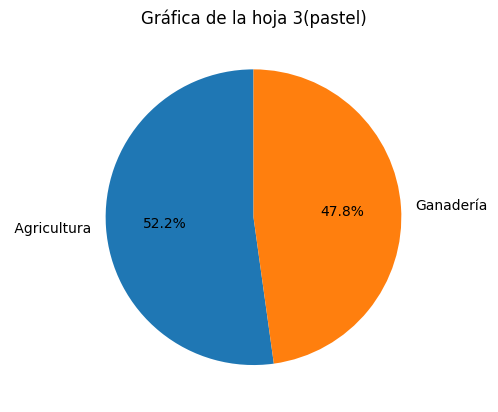
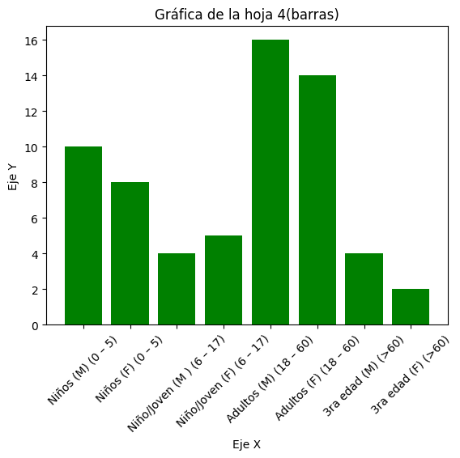
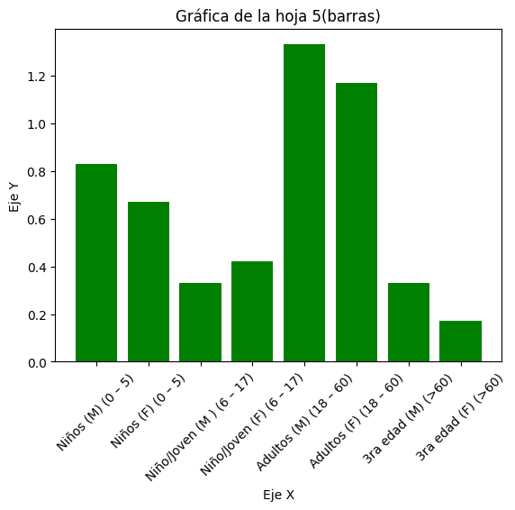
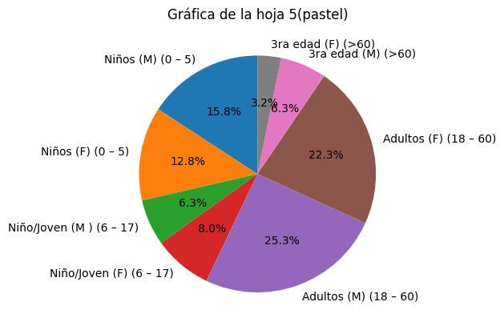
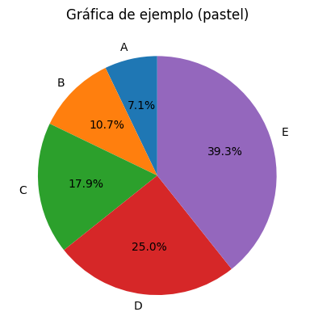

# otm106_practica4

## Estudiante: Walter Antonio Machaca Anze

## Materia: Ofimática y tecnología multimedia OTM-106

## GENERACIÓN DE GRÁFICAS CON PYTHON 

Gráfico1 Barras

Gráfico1 pastel 

Gráfico2 Barras

Gráfico2 pastel 

Gráfico3 Barras

Gráfico3 pastel 

Gráfico4 Barras

Gráfico4 pastel 

Gráfico5 Barras

Gráfico5 pastel 

Gráfico ejemplo Barras

Gráfico ejemplo pastel 

